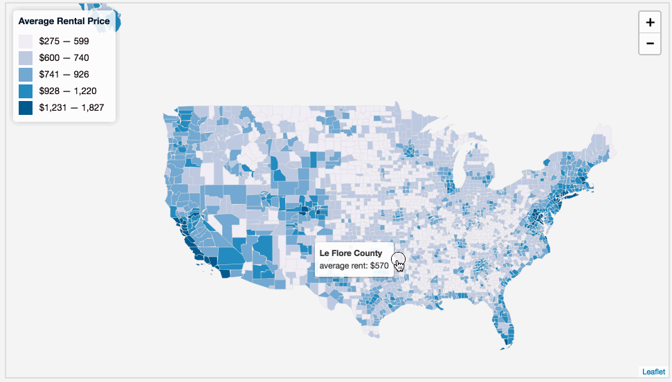

# Lab 10: Web Mapping A Choropleth Map

Examine the contents of the *lab-10/data/* directory. This directory includes a starter template *index.html* file and a *counties_median_rent_2015.json* data file produced by joining data downloaded from [American FactFinder](https://factfinder.census.gov) with US county polygons downloaded from the [US Census Cartographic Boundary Shapefiles](https://www.census.gov/geo/maps-data/data/cbf/cbf_counties.html).

You'll notice that each county has two attribute properties: a "NAME" and a "RENT", the latter of which is the median gross rent within the county. Also, **warning**: some polygons have null values for the RENT attribute.

Use this file to build a choropleth web map of US rental prices per county. It should look like this and include a tooltip or popup that displays the name of the county, the attribute being mapped (i.e., "median rent"), and the value of that attribute for that county. **4 pts**

**Figure 01.** Lab 10 Solution:

Use the lesson for guidance and edit the *lab-10/index.html* to fulfill the requirements listed below.
